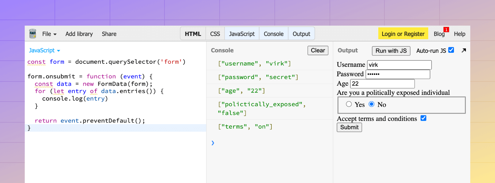

# HTML forms and surprises

HTML forms have particular serializing behavior attached to them that you need to understand and address to work with normalized data in your applications.

I see a few talking about it because we stopped using HTML forms with the rise of front-end frameworks. However, they are returning to HTML forms, so I expect more developers to encounter these surprises.

## Empty fields lead to empty strings

When you submit an HTML form leaving an optional field empty, the backend receives an empty string.

For example, if you have a database column `country` set to nullable, you would want to store `null` as a value inside this column when the user does not select a country.

However, with HTML forms, the backend receives an empty string, and you might insert an empty string (unless you carefully check each input field) into the database instead of leaving the column as `null`.

VineJS allows you to convert empty strings to `null` globally using the `vine.configure` method. 

```ts
import vine from '@vinejs/vine'

vine.configure({
  convertEmptyStringsToNull: true,
})
```

Now, you can define the schema for the `country` field as follows.

```ts
const schema = vine.schema({
  country: vine.string().nullable()
})

const data = {
  country: ''
}

// output { country: null }
```

## Number input results in a string value

The value of the `<input type="number">` field is not a number but a string. This is because there are no data types in HTML forms, and the values are always strings.

Therefore, you will have to normalize the HTML form fields and work with specific data types at some stage. 

VineJS performs this normalization alongside validations. For example, the `string.number` type will attempt to convert the string-based numeric values to a JavaScript number data type before performing additional validations.

```ts
const schema = vine.schema({
  age: vine.number().min(18)
})

const data = {
  age: '32'
}

// output { age: 32 }
```

The same holds true for boolean values as well. The `true` and `false` values for the input fields will result in a string representation of a boolean. However, the `vine.boolean` schema type can handle the normalization for you.

## Checkboxes are not Booleans

Checkboxes are the notorious ones. If you do not check a checkbox, it will be removed from the data object, and selecting a checkbox will result in a string value `"on"`.

In VineJS, we have a dedicated schema type called `schema.accepted`, which ensures the field is present and must have one of the following values.

- `"on"`
- `"1"`
- `"yes"`
- `"true"`

If validation passes, the value will be normalized to `true`.

```ts
const schema = vine.schema({
  terms: vine.accepted()
})

const data = {
  terms: 'on'
}

// output { terms: true }
```

## Everything together

Here's a small demo of what we have covered so far. https://jsbin.com/detixawaxa/edit?html,js,console,output


